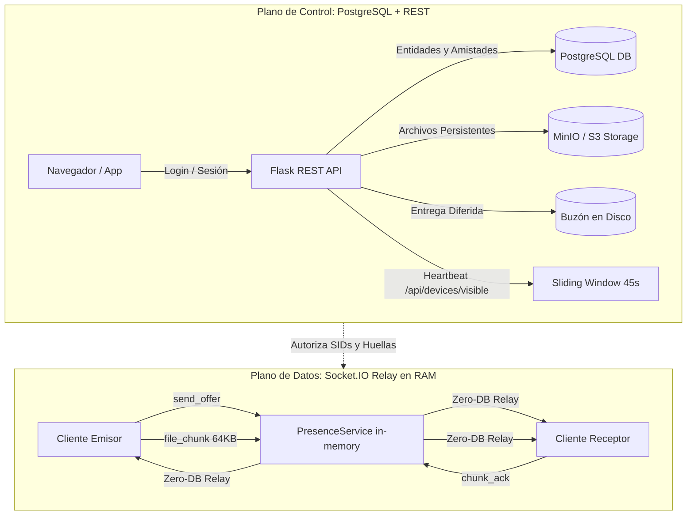
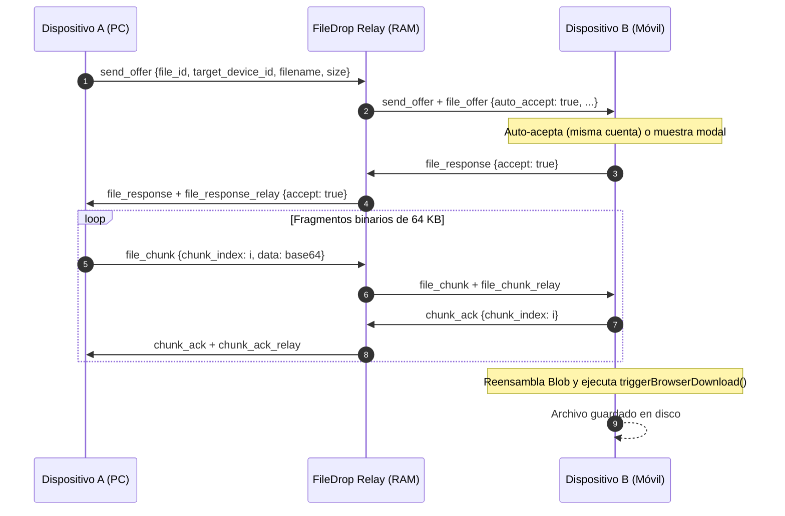

# Arquitectura Híbrida: FileDrop (Enlace)
*Combinando la velocidad instantánea en memoria de la versión original con la seguridad y persistencia multiusuario*

---

## 1. Visión General y Motivación

Históricamente, **FileDrop (Enlace)** funcionaba como una aplicación local monolítica en memoria (`server.py`):
* Los dispositivos se descubrían sin base de datos ni cuentas.
* Las transferencias de archivos fluían directamente a través de Socket.IO en RAM sin latencia de disco ni de red externa.
* Cada par de dispositivos compartía un mismo espacio efímero.

La posterior refactorización introdujo **capacidades empresariales multiusuario**:
* Persistencia en **PostgreSQL** (usuarios, dispositivos, transferencias, amistades).
* Almacenamiento en la nube **S3 / MinIO** con explorador y enlaces públicos presignados.
* **Buzón diferido (Offline Mailbox)** para entrega asíncrona de archivos.
* Soporte para **Reverse Proxy (Traefik / Nginx)** y autenticación mediante sesiones HTTP seguras.

Sin embargo, vincular rígidamente cada fragmento de WebSocket a consultas SQL y validaciones de cookies introdujo cuellos de botella (errores `429 Too Many Requests`, desconexiones en móviles y transferencias que no cargaban).

La **Arquitectura Híbrida** resuelve esto desacoplando estrictamente el sistema en dos planos independientes:
1. **Plano de Control (Persistencia, Seguridad y Descubrimiento)**
2. **Plano de Datos (Streaming P2P de Alta Velocidad en RAM)**

---

## 2. Separación de Planos de Arquitectura

### 2.1 Plano de Control (PostgreSQL + REST)
* **Responsabilidad:** Autenticación de usuarios, registro de hardware fingerprint, ACLs de amistad, almacenamiento en S3 y buzón diferido.
* **Operación:** Se ejecuta únicamente en login, carga inicial de la página o polling periódico (cada 10-15 segundos).
* **Beneficio:** Garantiza aislamiento multiusuario y persistencia sin afectar el rendimiento de streaming.

### 2.2 Plano de Datos (WebSocket Relay en RAM)
* **Responsabilidad:** Streaming de fragmentos binarios (64 KB), control de flujo por ACKs y sincronización de portapapeles.
* **Operación:** Se ejecuta 100% en memoria en `PresenceService._device_to_sid`. **Cero consultas SQL por fragmento binario transmitido**.
* **Beneficio:** Misma velocidad de transferencia pura en microsegundos que la versión original legacy.

---

## 3. Características Clave de la Solución Híbrida

### 3.1 Detección de Presencia Híbrida
Los dispositivos móviles suspenden frecuentemente las conexiones WebSocket en segundo plano para ahorrar batería. Para evitar falsos positivos de desconexión (`⚪ Desconectado`):
* Un dispositivo se marca `🟢 En línea` si:
  $$\text{En línea} = (\text{WebSocket activo en RAM}) \lor (\text{now} - \text{last\_seen\_at} < 45\text{s})$$
* Al detectar actividad REST cada 10 segundos, ambos dispositivos se mantienen continuamente verdes.

### 3.2 Auto-Aceptación Inteligente entre Dispositivos Propios
* **Entre dispositivos de la misma cuenta (`is_own_account == True`):**
  * Al enviar de tu PC a tu Celular (o viceversa), el receptor **auto-acepta** y comienza la descarga inmediatamente, eliminando la necesidad de interactuar con el diálogo en el teléfono.
* **Entre cuentas externas / Amigos (`is_own_account == False`):**
  * Se preserva el modal interactivo de confirmación con vista previa, nombre y tamaño para evitar descargas no deseadas.

### 3.3 Simetría Total de Protocolo
El backend y los clientes soportan ambas convenciones de nombres de forma indistinta:
* `target_device_id` y `to_device_id`
* `filename` y `file_name`
* `size` y `file_size`
* `mimetype` y `file_type`
* Eventos directos (`send_offer`, `file_response`, `file_chunk`, `chunk_ack`) y relays legados (`file_offer`, `file_response_relay`, `file_chunk_relay`, `chunk_ack_relay`).

### 3.4 Fallback Automático a Buzón
Si un dispositivo objetivo se encuentra temporalmente sin socket activo (por ejemplo, teléfono bloqueado en el bolsillo):
* La interfaz detecta la ausencia del túnel en vivo y sugiere automáticamente el **Buzón temporal**.
* El emisor puede depositar el archivo con un solo clic y el receptor lo descarga cuando desbloquea el terminal.

---

## 4. Secuencia de Transferencia P2P en Memoria

---

## 5. Resumen de Archivos Modificados

* [app/services/presence_service.py](file:///c:/Users/kevin/Desktop/proyectos/filedrop/app/services/presence_service.py): Cálculo de presencia híbrida (socket RAM + ventana REST 45s).
* [app/sockets/handlers.py](file:///c:/Users/kevin/Desktop/proyectos/filedrop/app/sockets/handlers.py): Relay pasante en memoria con flag `auto_accept` y tolerancia simétrica de payloads.
* [static/transfer.js](file:///c:/Users/kevin/Desktop/proyectos/filedrop/static/transfer.js): Exportación explícita de `offerFile`, `prepareIncoming`, `itemsFromDataTransfer` y descarga con `Blob`.
* [static/app.js](file:///c:/Users/kevin/Desktop/proyectos/filedrop/static/app.js): Auto-recepción entre dispositivos propios y fallback interactivo a Buzón.
* [static/service-worker.js](file:///c:/Users/kevin/Desktop/proyectos/filedrop/static/service-worker.js): Versión `enlace-shell-v15` para invalidación inmediata de caché.
